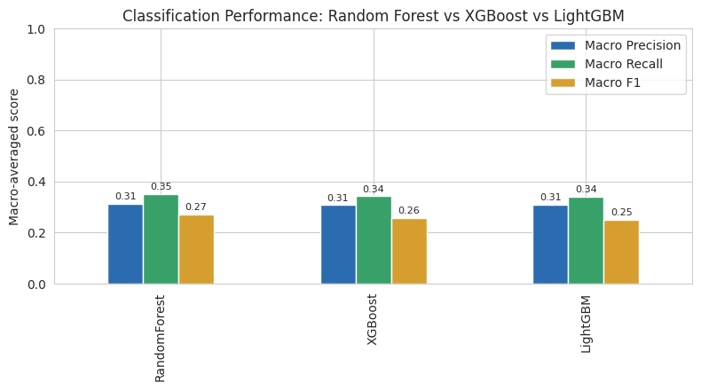
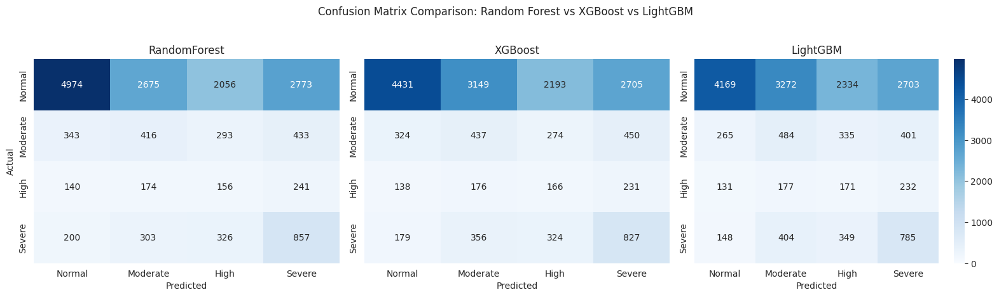
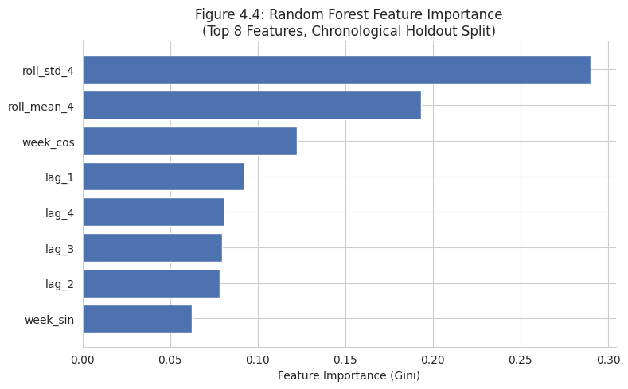
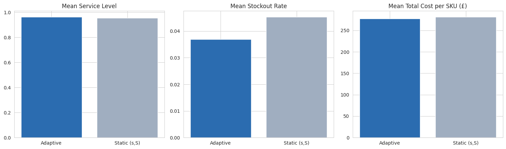

# ML-Based Demand Shock Prediction for Adaptive Inventory Replenishment

**MRes Computing dissertation · University of Bolton · 2026**

Most replenishment policies are static. They set reorder points from average demand, so when demand suddenly spikes they react too late, and the result is stockouts and lost sales. This project asks whether machine learning can give planners **early warning of how severe a demand shock will be**, and whether that warning can be turned into **better reorder decisions**.

The full pipeline is in [`dissertation_pipeline.ipynb`](dissertation_pipeline.ipynb).

## Research questions

1. Which model (Random Forest, XGBoost or LightGBM) predicts demand shock severity best?
2. Can predicted severity be translated systematically into replenishment decisions?
3. How does the adaptive approach affect cost, stockouts and service level, compared with a static (s,S) policy?

## Approach

```
Clean transactions → Weekly demand per SKU → Label shock severity → Predict severity → Adjust reorder levels → Simulate vs. static policy → Test significance
```

- **Data:** [UCI Online Retail](https://archive.ics.uci.edu/dataset/352/online+retail) (Chen, Sain and Guo, 2012), 541,909 transactions from a UK online retailer, Dec 2010 to Dec 2011. After cleaning (2.6% of rows removed: cancellations, non-product codes, invalid quantities), **1,636 SKUs** active in at least 30 of 54 weeks were modelled.
- **Shock labels:** a rolling z-score against each SKU's own previous 4 weeks (prior weeks only, so there's no data leakage), grouped into four classes: **Normal** (z < 1), **Moderate** (1–2), **High** (2–3) and **Severe** (≥ 3).
- **Features:** 4-week rolling mean and standard deviation, 1–4 week lags, and cyclical week-of-year encoding (`week_sin`, `week_cos`).
- **Validation:** a chronological 80/20 split (65,440 training and 16,360 test rows), `TimeSeriesSplit` cross-validation for tuning, and balanced class weights applied to all three models.
- **Decision rules:** predicted severity drives the reorder policy.

| Predicted severity | Replenishment action |
|---|---|
| Normal | Standard (s,S) reorder |
| Moderate | Safety stock +20% |
| High | Safety stock +40% |
| Severe | Order-up-to level +60% |

- **Evaluation:** SKU-by-SKU inventory simulation over the 10-week holdout, with paired Wilcoxon signed-rank tests and a bootstrap confidence interval.

## Results

### 1. Classification: Random Forest performed best

| Model | Accuracy | Macro precision | Macro recall | Macro F1 | Weighted F1 |
|---|---|---|---|---|---|
| **Random Forest** | **0.391** | **0.313** | **0.352** | **0.272** | **0.467** |
| XGBoost | 0.358 | 0.308 | 0.343 | 0.258 | 0.432 |
| LightGBM | 0.343 | 0.310 | 0.342 | 0.252 | 0.417 |



Predicting shock severity from demand history alone is hard. Shocks are rare (22% of weeks) and the classes are imbalanced. Random Forest was selected. It catches **51% of Severe shocks**, and it's **88% precise when it predicts Normal**. It struggles to separate the middle classes (High F1 = 0.09).



Recent **volatility** (`roll_std_4`, 29%) and **level** (`roll_mean_4`, 19%) were the strongest predictors, followed by seasonality (`week_cos`, 12%).



### 2. Inventory impact: fewer stockouts, same cost

| Metric (1,636 SKUs, 10 weeks) | Static (s,S) | Adaptive (ML) | Change |
|---|---|---|---|
| Average service level | 95.5% | 96.3% | +0.9% |
| Average stockout rate | 4.5% | 3.7% | **−18.5%** |
| Total holding cost | £246,448 | £257,249 | +4.4% |
| Total ordering cost | £77,860 | £73,840 | −5.2% |
| Total stockout cost | £135,956 | £123,219 | −9.4% |
| **Total inventory cost** | **£460,263** | **£454,308** | **−1.3%** |



### 3. Statistical significance

- **Service level and stockout rate:** both improvements are significant (Wilcoxon p < 0.0001).
- **Total cost:** the typical SKU's cost difference is **not significant** (Wilcoxon p = 0.124, median saving £0). **33.7% of SKUs (551)** cost less. The *mean* saving of £3.64 per SKU has a bootstrap 95% CI of [£1.13, £6.30], so the overall saving is real but small and comes from a minority of SKUs.

## Conclusion

The adaptive framework **cut stockouts by 18.5% and improved service level without raising total cost**, because extra holding cost was more than offset by lower stockout and ordering costs. The business case is **availability, not cost reduction**. The next step would be to target the policy at the SKU segments where it saves money.

## Limitations

- Single retailer, with no store or category dimension, and no promotion or event data
- Fixed 1-week lead time; only upward shocks are modelled
- Classifier performance on the middle severity classes is limited

## Run it yourself

1. Download `Online Retail.xlsx` from the [UCI repository](https://archive.ics.uci.edu/dataset/352/online+retail).
2. `pip install -r requirements.txt`
3. Set `DATA_PATH` in the notebook's Data Loading cell to where you saved the file. (It was built in Google Colab, where the file sits at `/content/`.)
4. Run all cells.

## Related

- [Portfolio case study: this project from a business analyst's perspective](https://chiamakaikpo.github.io/case-replenishment-ml.html)
- [Chiamaka Ikpo: portfolio](https://chiamakaikpo.github.io)
